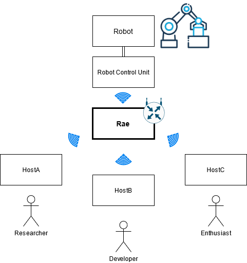

# Raeos
Download the official Operating System for the robot autonomy effector
- [Raeos](#raeos)
- [Connect](#connect)
  - [Via Ethernet](#via-ethernet)
  - [Via Wifi](#via-wifi)
  - [Via VSCODE SSH Extension](#via-vscode-ssh-extension)
- [Recommended network topology](#recommended-network-topology)
- [Enable Internet through Host Computer](#enable-internet-through-host-computer)
- [Add a new user](#add-a-new-user)
- [Activate the access point in ac-mode](#activate-the-access-point-in-ac-mode)
- [Backup an Image](#backup-an-image)
- [Tested WiFi AC USB-Stick for Linux Ubuntu](#tested-wifi-ac-usb-stick-for-linux-ubuntu)

# Connect 
## Via Ethernet
To setup an connection to the rae via Ethernet give your interface the right IP. It has to be `10.10.0.10`.
For Linux based Systems it is:
```bash
sudo ifconfig IF 10.10.0.10 netmask 255.255.255.0
```
IF is for example eth0. After setting the correct IP Adress you can connect via SSH.
The Standard-user is `romzn` and the password is `raeisgreat`. 
Rae hosts an little DNS Server which enables you to reach the System via `rae.local`.

```bash
ssh romzn@rae.local
```

## Via Wifi
The rae opens an access point with the name "rae" with the password "raeisawesome".
After successfully connected to the hotspot you can connect via ssh in the same manner like before:

```bash
ssh romzn@rae.local
```

## Via VSCODE SSH Extension
Install the following extension and setup an ssh connection with the `rae.local` domain and the user romzn
https://marketplace.visualstudio.com/items?itemName=ms-vscode-remote.remote-ssh

# Recommended network topology
The most comfortable communication with the system is via wireless-lan. For that you have to connect your Host and the Robot-control-unit with the rae accesspoint like mentioned before.



# Enable Internet through Host Computer
To route the Internet from your Host to the rae several steps are necessary. 
The following internet configuration is for the Ubuntu linux distribution:

First of all you have to activate Port forwarding on your Host and not on the RAE
```bash
sudo sysctl -w net.ipv4.ip_forward=1
```

after that you have to set some entries into your iptables to forward the packages correctly
```bash
sudo iptables -t nat -A POSTROUTING -s 10.7.0.1/24 -j MASQUERADE
sudo iptables -t nat -A POSTROUTING -s 10.10.0.1/24 -j MASQUERADE
```
To save them permanently onto your file System do:

```bash
sudo apt install iptables-persistent
sudo iptables-save  > /etc/iptables/rules.v4
```
Now you can test with `ping www.google.de` if the connections works.

# Add a new user
Add a new user and add them to the groups __dialout__ and __tty__

```bash
sudo adduser otto
sudo usermod -a -G tty otto
sudo usermod -a -G dialout otto
```

# Activate the access point in ac-mode
The prebuilt image already covers the configuration
If you want to checkout how its done look [here](access-point-dns-dhcp)

# Backup an Image
Write SD-Card to an Image
```bash
sudo dd bs=4M if=/dev/sdb | pv | sudo dd of=raeos18-`date +%d%m%y`.img
```
Install PiShrink
```
wget https://raw.githubusercontent.com/Drewsif/PiShrink/master/pishrink.sh
chmod +x pishrink.sh
sudo mv pishrink.sh /usr/local/bin
```
Example for Shrinking an Image
```
sudo pishrink.sh pi.img
```

# Tested WiFi AC USB-Stick for Linux Ubuntu
Successfuly tested an USB Stick [TP-Link Archer T3U AC1300 ](https://www.amazon.de/gp/product/B07M69276N/ref=ppx_yo_dt_b_asin_title_o00_s00?ie=UTF8&psc=1)

<p align="center">

</p>

The drivers has to be installed manually:

```bash
git clone https://github.com/cilynx/rtl88x2bu.git
cd rtl88x2bu
VER=$(sed -n 's/\PACKAGE_VERSION="\(.*\)"/\1/p' dkms.conf)
sudo rsync -rvhP ./ /usr/src/rtl88x2bu-${VER}
sudo dkms add -m rtl88x2bu -v ${VER}
sudo dkms build -m rtl88x2bu -v ${VER}
sudo dkms install -m rtl88x2bu -v ${VER}
sudo modprobe 88x2bu
```